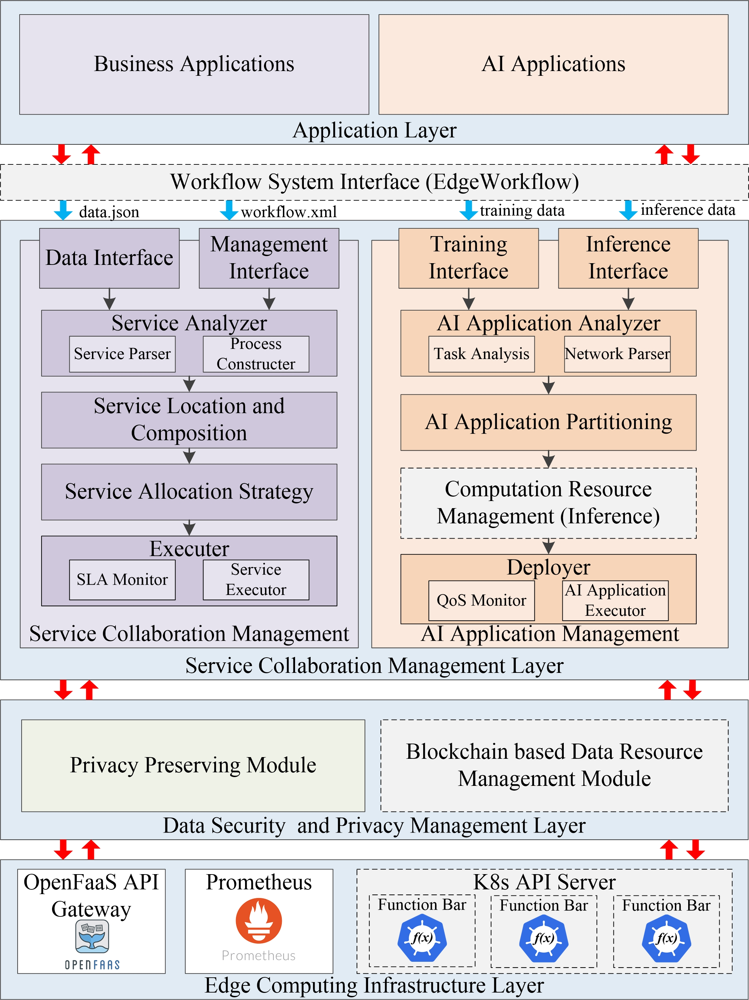
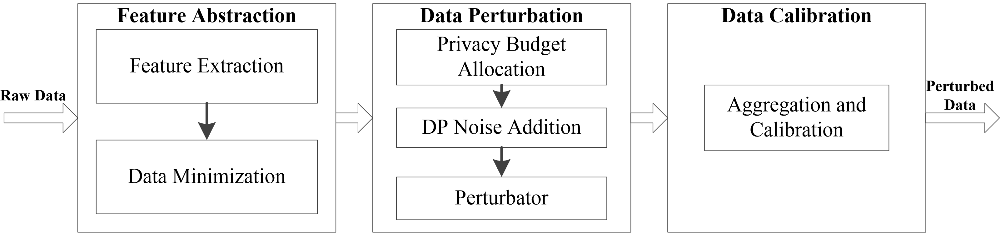
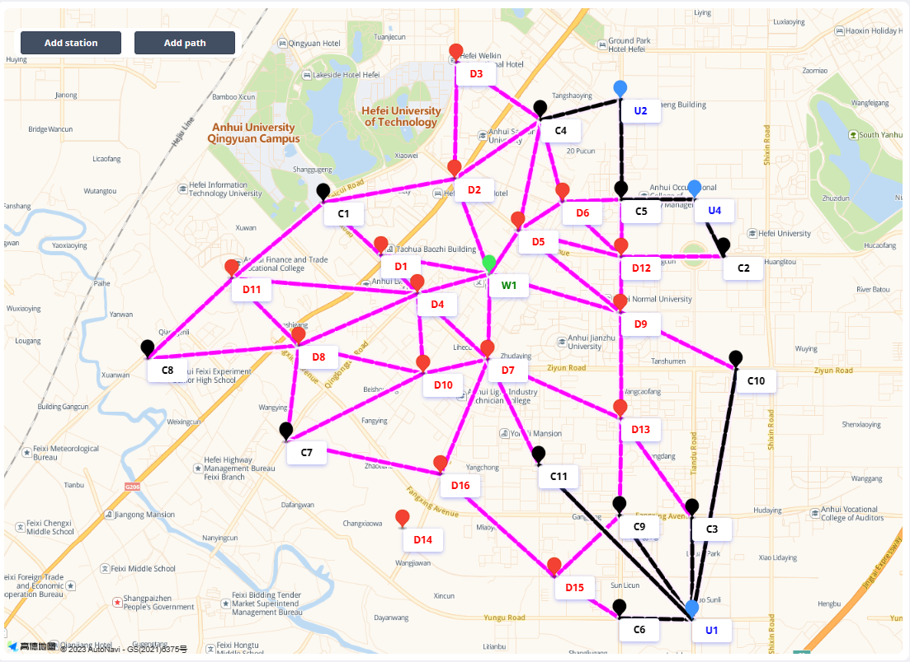
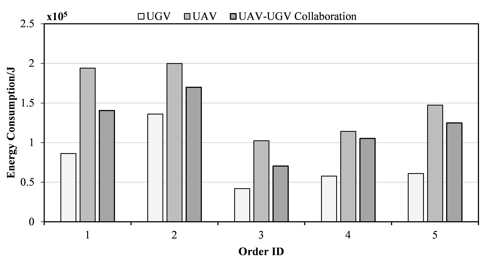
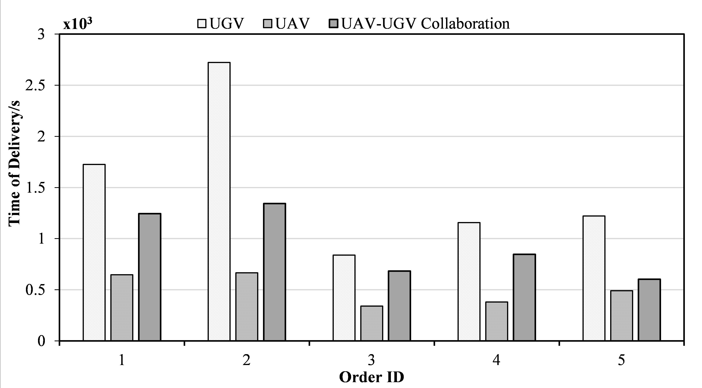
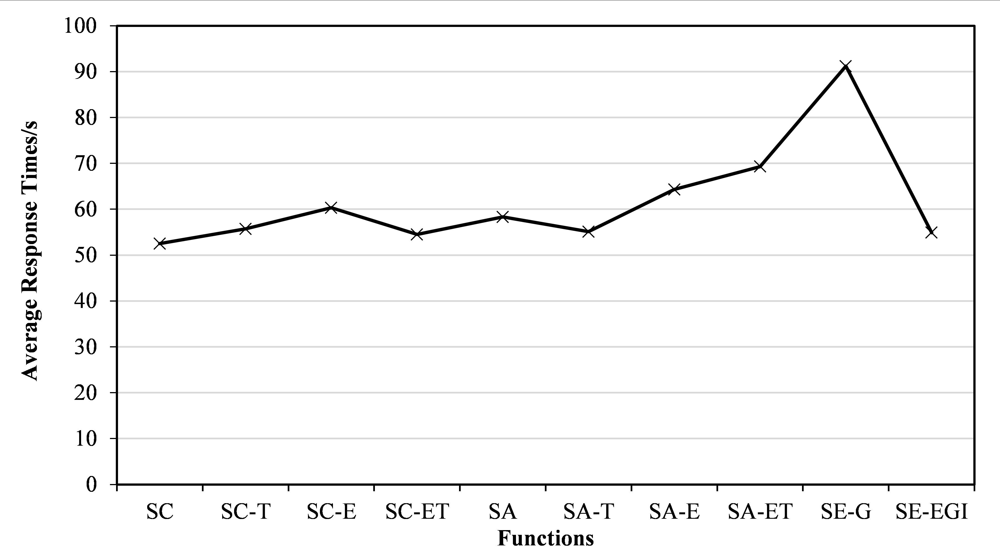

# EXPRESS 2.0
* An Intelligent Service Management Framework for AIoT Systems in the Edge
* we propose EXPRESS 2.0 which is an intelligent service management framework for AIoT in the edge. Specifically, on top of the existing EXPRESS platform (https://github.com/ISEC-AHU/UAV-EXPRESS) and EdgeWorkflow system (https://github.com/ISEC-AHU/EdgeWorkflow) , EXPRESS 2.0 includes the service collaboration management module, AI application management module, and data security and privacy management module.
* The demo video can be found at https://youtu.be/IHhQnzCL3sY.
# Developer
* Developer organization:
1. ISEC laboratory, School of Computer Science and Technology, Anhui University, Hefei, China
2. School of Information Technology, Deakin University, Geelong, Australia
3. Department of Computing Technologies, Swinburne University of Technology, Melbourne, Australia
* Developer member: Jia Xu, Wuzhen Pan, Xiao Liu, Xuejun Li, Aiting Yao, Yun Yang
# System Framework

* 1.Framework Design
* The bottom edge computing resources layer is the basic of EXPRESS 2.0 which includes OpenFaaS-based computational resources. The OpenFaaS is the popular open source serverless framework in the academic and industrial areas [11]. It consists of three modules, which are OpenFaaS API gateway, Prometheus and K8s API server. The OpenFaaS API gateway manages and invokes the function bar in K8s API server. Besides, it receives the monitor data of function bar from the Prometheus. Prometheus collects monitor metrics of function bar which are available via the Gateway's API and used for computational resources auto-scaling. The K8s API server contains a series of function bars which can be used to deploy various services or execute different computational tasks. Benefit from serverless technology, the edge computing resources layer allows to develop complex service or applications as the composition functions.
* The data security and privacy management layer is composed by privacy protection module and blockchain-based data resource management module. The differential privacy obfuscation module focuses on solving the user’s data privacy protection problem. It extracts the feature data from IoT device’s raw data that related to the sensitive data. Then, the feature data is obfuscated by local differential privacy algorithm. The blockchain-based data resource management module inherited from our previous work EXPRESS. It is primarily responsible for ensuring the security of business process data in EC-based smart software systems. 
* The services resources management layer focus on the management problem of business services and AI applications. It consists of service collaboration management module and AI application management module. There are three core functions for service collaboration management module. Firstly, it needs to receive the business application’s service request from the application layer and generate the best service composition plan. Then, it needs to find the best service allocation plan. At last, it needs to transfer the service request for execution. Based on the above functional requirements, this module has four sub-modules, which are service analyzer, service location and composition, service allocation strategy, and executor. The service analyzer sub-module analyzes the requirement of resource types and process dependencies based on the input service requests. The service location and composition sub-module generates the best service composition plan according to the service requirement. The service allocation strategy sub-module contains different algorithms for optimizing the service allocation plan. The executor receives the best service allocation plan from the above sub-module, packages it into a service request and sends it to the edge computing environment for execution. The executor also needs to monitor the performance metrics of service during service execution.
* The AI application management module addresses the training and inference process of various AI applications in AIoT systems and solves the computational resource management problem in the above process. It composed by four modules, which are AI application analyzer module, AI application partitioning module, computational resource management module (inference process only) and deployer module. The AI application analyzer module is responsible for AI model evaluation (training process) and AI service request analysis (inference process). It will generate the network structures of AI models or characteristics of AI applications. The AI application partitioning module is used for AI model partitioning (inference process) and AI service composition (training process). The computational resource management module focus on optimize the AI application’s offloading and scheduling plan during the inference process. The deployer module is responsible for AI model packaging, deploy (training process) and AI application execution (inference process). 
* Due to the collaborative requirements of business service applications and AI applications in AIoT software systems, it is necessary to generate and manage their collaboration models. Therefore, the EXPRESS 2.0 framework imports the workflow system interface from our previous work in [4, 12] between the application layer and the service resource management layer. The application layer contains two types of applications, which are business applications and AI applications. The business applications are used to implement various AIoT software system services or functions, such as order assignment. AI applications are various AI applications that required implementing system functions in EC-based AIoT software systems.
* 2.Privacy Peserving Analysis and Discussion
* In EXPRESS 2.0, the privacy preserving module is responsible for preventing the risk of sensitive data privacy leakage. Currently, there are two technologies that can solve the privacy preserving problem for AI applications, which are federated learning and differential privacy techniques. Federated learning technology is designed with the goal of information security when exchanging data, which means protecting the data privacy of IoT devices. The differential privacy technology is a data sharing tool that enables the sharing of only data’s statistical characteristics without disclosing information specific. Due to the limitation of the number of pages, we demonstrate the design of the privacy preserving module with differential privacy technique as an example. 

* As shown in Figure, the privacy preserving module is divided into three phases, which are feature abstraction, data perturbation and data calibration. At first, the raw data of IoT devices is transfer to the feature extraction sub-module to identify sensitive features that require privacy preserving. Secondly, data minimization sub-module needs to reduce the size of the data features to ensure that only privacy-preserving data is retained. In the data perturbation phase, the privacy budget is first assigned to each data feature. Next, the type of differential privacy noise function is selected. Finally, the raw data are noised in the perturbator. In the data calibration phase, it is necessary to calibrate the various types of data after noise addition to improve the data accuracy while suppressing the estimation bias.

# Framework Evaluation
## Experimental Environment

The experimental environment was generated based on real map data surrounding Anhui University in Shushan District, Hefei City, Anhui Province, China. The generated environment is illustrated in the figure below.



The experimental environment consists of the following components:

- 1 starting nodes
- 3 destination nodes
- 16 UAV delivery station
- 10 UGV stations

The parameter configurations of UAVs and UGVs at each station are presented in the following table:

**UAV station**

| UAV Type(w) | Idle Power(w) | Maximum Power(w) | Speed(m/s) | Payload(g) | Battery Capacity(Ah) |
|:----------:|:----------:|:-------------:|:-----:|:-------:|:---------------:|
| UAV<small>1</small>       |   200   |    300     | 6|  1500 |     180      |
| UAV<small>2</small>       |   300   |    400     | 8|  3000 |     320     |
| UAV<small>3</small>       |  400  |    500    | 10| 5000 |    400     |

**UGV station**

| UGV Type(w) | Idle Power(w) | Maximum Power(w) | Speed(m/s) | Payload(g) | Battery Capacity(Ah) |
|:----------:|:----------:|:-------------:|:-----:|:-------:|:---------------:|
| UGV<small>1</small>       |   30   |    80     | 3|  5000 |     1500      |
| UGV<small>2</small>       |   50   |    100     | 4|  12000 |     2100     |
| UGV<small>3</small>       |  80  |    130    | 5| 20000 |    2500     |


Please note that the table above presents the quantities of drones and unmanned vehicles allocated at each station, along with their respective parameter configurations.


## Service Composition and Resource Management Interface

In this paper, we make detailed comparison experiments between UAV-UGV Collaboration algorithm and the other two policies in terms of metrics such as time and energy consumption. The compared algorithms are UGV only, UAV only. The service collaboration algorithms are implemented using the service composition  and resource management interface of the EXPRESS2.0 framework. The algorithm interface can be found at `src/main/java/com/example/core` path.
1. ServiceComposition.java
```java
int uavType = 2, ugvType = 2;/*During the service composition phase, the parameters for UAVs and
UGVs are preconfigured to generate the best service composition plan.*/
case "time":           /* Optimization Object: Shortest Time*/
                    if (environmentFlag == 0) {
                        route = routePlanUtils.getShortestTimeRoute(order.getStartStation(),   order.getConsignee(),
                                drone, car, weigh); 
                                /*To invoke the service composition algorithm, specifically the shortest
                                time algorithm, you can utilize the RoutePlanUtils.java file located at
                                src/main/java/com/example/utils/ path. This file contains the
                                implementation of the shortest time algorithm for service composition.*/
                    } else {
                        String carToUserDistance1 = GuideRoutePlanUtils.getCarToUserDistance(
                                carToCustomerService.getAllCarStationNameByCustomerName(
                                        order.getConsignee()), order.getConsignee());
                        f = 1;
                        path = OpenFaasUtils.getShortestTimePath1(order.getStartStation(), order.getConsignee()
                                , uavType - 1, ugvType - 1, weigh, carToUserDistance1);
                        String[] split2 = path.split(",");
                        route = new ArrayList<>(Arrays.asList(split2));
                    }
                    break;
```

2. ResourceAllocation.java
```java
int weigh = (int) (order.getWeight() * 1000);
Drone drone = droneService.getById(uavType);
Car car = carService.getById(ugvType); /*During the resource allocation phase, the parameters for UAVs
and UGVs need to be obtained from the delivery orders in order to generate the best resource allocation plan.*/
case "energy":       /* Optimization Object: Energy Consumption*/
                   if (environmentFlag == 0) {
                       route = routePlanUtils.getShortestEnergyRoute(order.getStartStation(), order.getConsignee(),
                               drone, car, weigh);
                               /*To invoke the resource allocation algorithm, specifically the energy
                               consumption optimization algorithm, you can utilize the GuideRoutePlanUtils.java file located at
                               src/main/java/com/example/utils/path. This file contains the
                                implementation of the energy consumption optimization algorithm for
                                resource allocation.*/
                   } else {
                       String carToUserDistance2 = GuideRoutePlanUtils.getCarToUserDistance(
                               carToCustomerService.getAllCarStationNameByCustomerName(
                                       order.getConsignee()), order.getConsignee());
                       f = 1;
                       path = OpenFaasUtils.getShortestEnergyPath2(order.getStartStation(), order.getConsignee()
                               , uavType - 1, ugvType - 1, weigh, carToUserDistance2);
                       String[] split3 = path.split(",");
                       route = new ArrayList<>(Arrays.asList(split3));
                   }
                   break;
```


1. Energy Consumption and Time of Delivery


* We evaluate the implemented system in terms of both service response time and delivery service overhead. The core metric to measure the service overhead of UAV-UGV delivery system is the energy consumption and time of delivery. After comparing the service costs of different delivery orders, it can be found that the energy and time costs of the delivery solution using the service collaboration method are 7%-27% and 27%-50% less than other methods.

* For system response time, we tested 10 functional modules of the system deployed in OpenFaaS, and their average response times were all much less than the ideal server response time of 250 ms.
# Full Paper Access
Access from <A href="https://drive.google.com/file/d/1TtCBhh5v9CdJMO6-V3eROy7-PRBlgELR/view?usp=sharing">https://drive.google.com/file/d/1TtCBhh5v9CdJMO6-V3eROy7-PRBlgELR/view?usp=sharing</A>
## How to run EXPRESS 2.0 ?
1.  Development Environment
	+	IDE: IntelliJ IDEA 2020.1 x64
	+	Programming language: Java
	+	JDK: 1.8
	+	SpringBoot: 2.6.11
	+	mysql: 5.7.29
	+	Mybatis-Plus: 3.5.1
	+	Amap js api:1.4.15
	+	OpenFaaS
2.	Deployment
	+	Create a maven project in IntelliJ IDEA.
	+	Inside the project directory, initialize an empty Git repository with the following command.
	+	git init
	+	Add the Git repository of project as the origin remote.
	+	git remote add origin https://github.com/ISEC-AHU/EXPRESS2.0
	+	Pull the contents of the repository to your machine.
	+	git pull origin master
	+	The openfaas service-related class, OpenFaasUtils, under the utils package, needs to be modified for your own deployed service. If you are unable to deploy openfaas, we offer a way to run it locally:  Modify the ServiceComposition, ResourceAllocation, and SecurityService in the core package, set the openFaasFlag to 0, and restart the project to use the local service. 
	+	Project operation requires multiple requests for Autonavi background service, please ensure that your network is unobstructed.  
	+	We provide free js api key with access limit for your research, you can also apply for a new js api key, just change the key in the page to your own. 
	+	URL: http://localhost:8081
# References
1.	H. Xiao, C. Xu, Y. Ma, S. Yang, L. Zhong and G. Muntean, “Edge Intelligence: A Computational Task Offloading Scheme for Dependent IoT Application,” IEEE Transactions on Wireless Communications, vol. 21, no. 9, pp. 7222-7237, 2022. 
2.	S. Popoola, R. Ande, B. Adebisi, G. Gui, M. Hammoudeh and O. Jogunola, “Federated Deep Learning for Zero-Day Botnet Attack Detection in IoT-Edge Devices,” IEEE Internet of Things Journal, vol. 9, no. 5, pp. 3930-3944, 2021.
3.	J. Xu, X. Liu, X. Li, L. Zhang and Y. Yang, “EXPRESS: An Energy-Efficient and Secure Framework for Mobile Edge Computing and Blockchain based Smart Systems,” In 35th IEEE/ACM International Conference on Automated Software Engineering, 2020, pp. 1283-1286.
4.	K. Wang, L. Wang, C. Pan and H. Ren, “Deep Reinforcement Learning-based Resource Management for Flexible Mobile Edge Computing: Architectures, Applications, and Research Issues,” IEEE Vehicular Technology Magazine, vol. 17, no. 2, pp. 85-93, 2022.
5.	J. Xiong and H. Chen, “Challenges for Building a Cloud Native Scalable and Trustable Multi-Tenant AIoT Platform,” In 2020 IEEE/ACM International Conference On Computer Aided Design (ICCAD), 2020, pp. 1-8.
6.	N. Nahar, S. Zhou, G. Lewis and C. Kästner, “Collaboration Challenges in Building ML-enabled Systems: Communication, Documentation, Engineering, and Process,” In 44th International Conference on Software Engineering, 2022, pp. 413-425.
7.	S. Kim, K. Ko, H. Ko and V. Leung, “Edge-Network-Assisted Real-Time Object Detection Framework for Autonomous Driving,” IEEE Network, vol. 35, no. 1, pp. 177-183, 2021.
8.	L. Chu, X. Li, J. Xu, A. Neiat and X. Liu, “A Holistic Service Provision Strategy for Drone-as-a-Service in MEC-based UAV Delivery,” In IEEE International Conference on Web Services (ICWS), 2021, pp. 669-674.
9.	L. Khan, Y. Tun, M. Alsenwi, M. Imran, Z. Han and C. Hong, “A Dispersed Federated Learning Framework for 6G-enabled Autonomous Driving Cars,” IEEE Transactions on Network Science and Engineering, pp. 1-12, 2022.
10.	D. Xie, Y. Hu and L. Qin, “An Evaluation of Serverless Computing on X86 and ARM Platforms: Performance and Design Implications,” In 14th International Conference on Cloud Computing (CLOUD), 2021, pp. 313-321.
11.	X. Li, T. Chen, D. Yuan, J. Xu and X. Liu, “A Novel Graph-based Computation Offloading Strategy for Workflow Applications in Mobile Edge Computing,” IEEE Transactions on Services Computing, pp. 1-14, 2022.
12.	J. Xu, X. Liu, X. Li, L. Zhang, J. Jin and Y. Yang, “Energy Aware Computation Management Strategy for Smart Logistic System with MEC,” IEEE Internet of Things Journal, vol. 9, no. 11, pp. 8544-8559, 2021.
13.	J. Xu, R. Ding, X. Liu, X. Li, J. Grundy and Y. Yang, “EdgeWorkflow: One Click to Test and Deploy your Workflow Applications to the Edge,” Journal of Systems and Software, vol. 193, pp. 1-16, 2022.
14.	X. Liu, L. Fan, J. Xu, X. Li, L. Gong, J. Grundy and Y. Yang, “FogWorkflowSim: An Automated Simulation Toolkit for Workflow Performance Evaluation in Fog Computing,” In 34th IEEE/ACM International Conference on Automated Software Engineering (ASE), 2019, pp. 1114-1117.
15.	R. Li, H. Liu, G. Lou, X. Zheng, X. Liu and T. Chen, “Metamorphic Testing on Multi-module UAV Systems,” In 36th IEEE/ACM International Conference on Automated Software Engineering (ASE), 2021, pp. 1171-1173.


